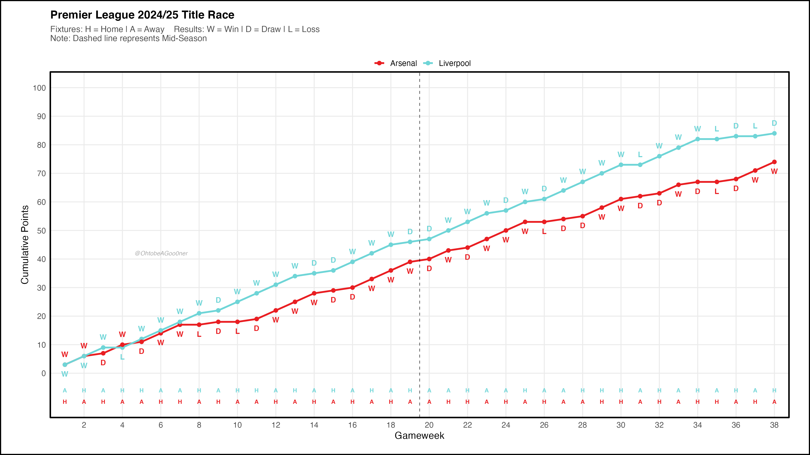
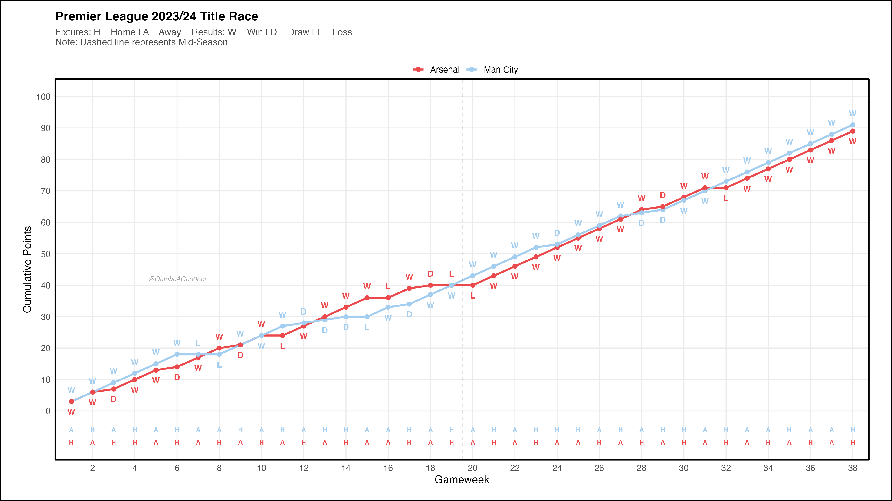
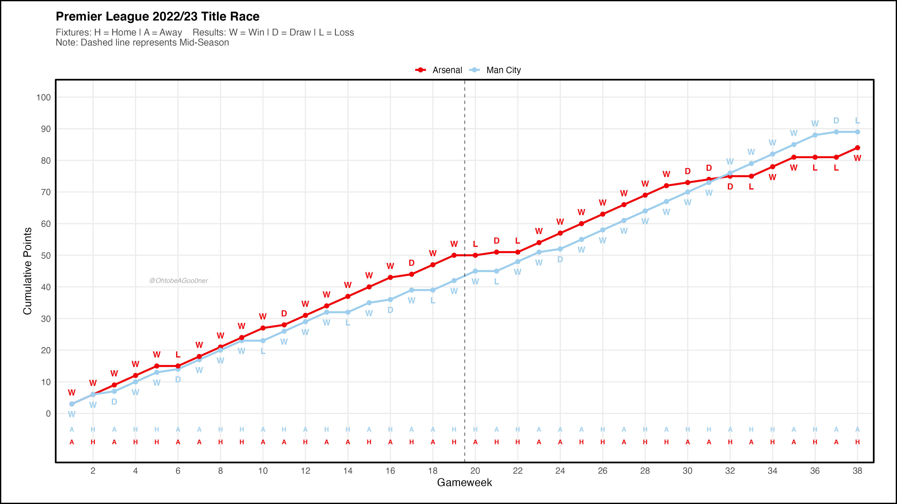
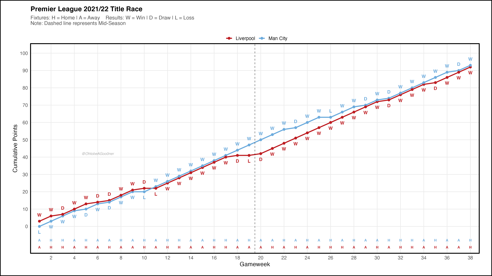
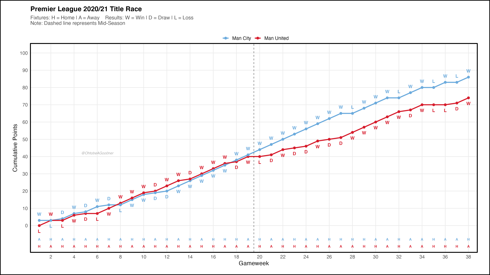
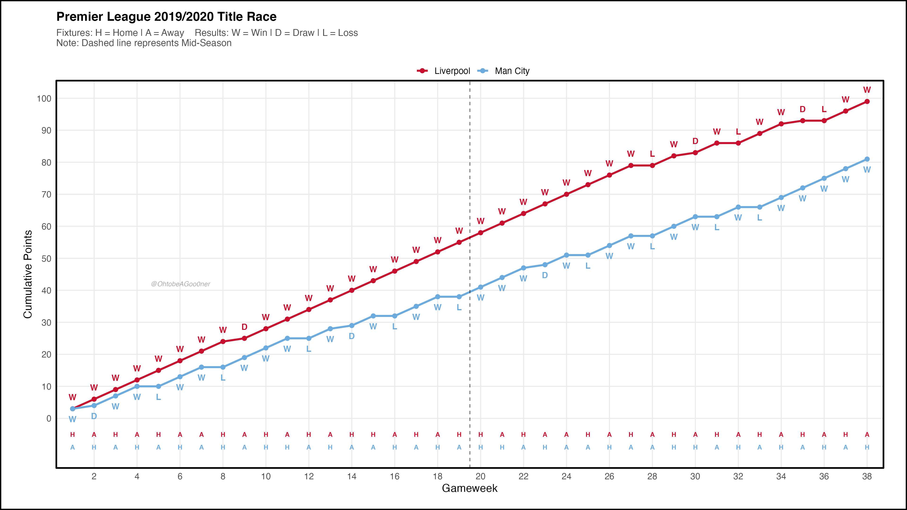
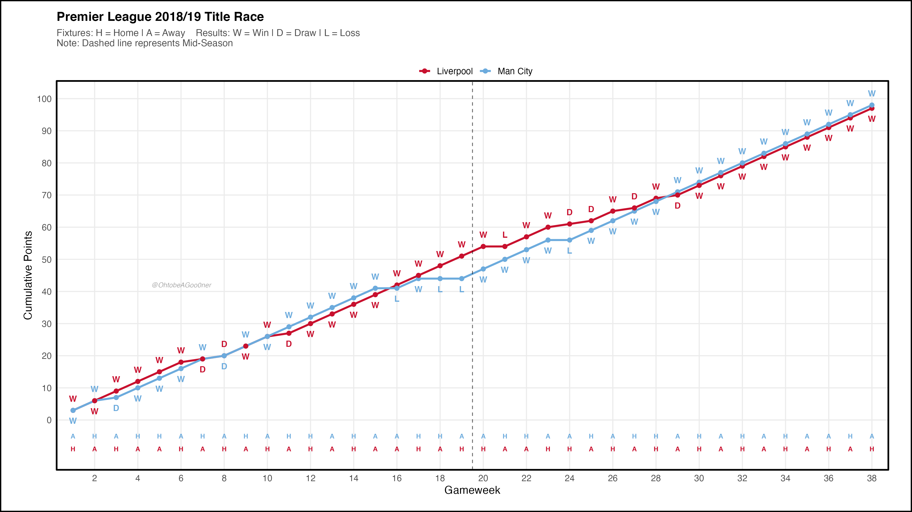
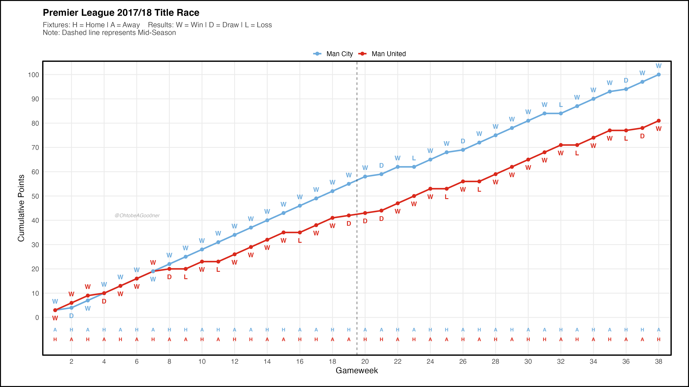
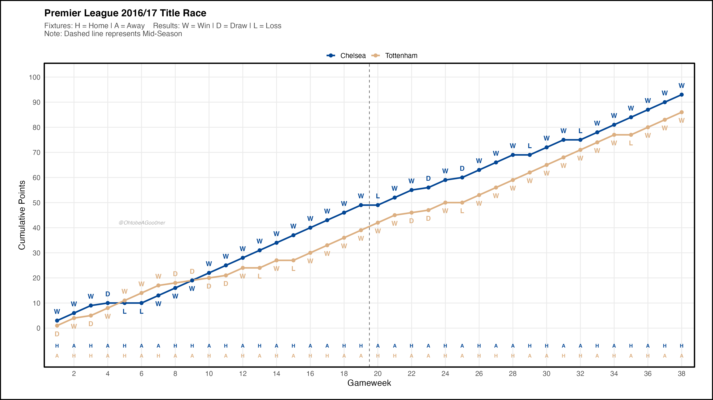
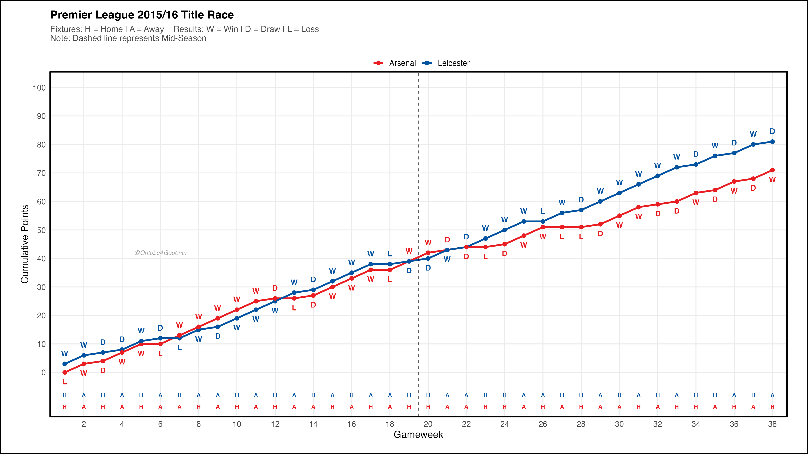

### Analysis Overview

While this began as a data visualization exercise, the results tell a compelling story of market concentration in football. We see the shift from the "unpredictable" era—highlighted by Leicester City’s 5000-to-1 title win—to a high-efficiency duopoly dominated by Manchester City and Liverpool, where finishing with 90+ points no longer guarantees a trophy.

### Season-by-Season Visualization

::: panel-tabset
## 2024/25

## 2023/24

## 2022/23

## 2021/22

## 2020/21

## 2019/20

## 2018/19

## 2017/18

## 2016/17

## 2015/16

:::

### Data & Methodology

The data was sourced from [Football-Data.co.uk](https://www.football-data.co.uk/) and processed in **R**.

-   **Visualization:** Built with `ggplot2` using a custom-themed layout ($16 \times 9$ ratio).
-   **Economic Lens:** The project examines the "winner-take-all" nature of modern football, where the marginal return on point accumulation has shifted drastically over the last decade.
